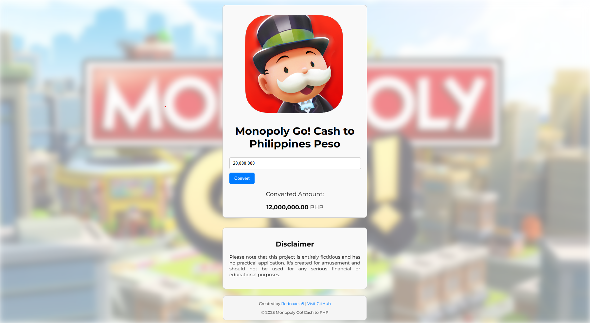

# Monopoly Cash to Philippine Peso Converter
The <b>Monopoly Cash to Philippine Peso Converter</b> is a spoof website generator designed purely for entertainment purposes. It whimsically pretends to convert Monopoly money into Philippine Pesos, adding a touch of humor to the world of currency conversion.

## Disclaimer
Please note that this project is entirely fictitious and has no practical application. It's created for amusement and should not be used for any serious financial or educational purposes.

## How does it work?
The Monopoly Cash is humorously "converted" into Philippine Pesos with a conversion rate of 60 percent, reflecting the playful nature of this project.

```javascript
conversionRate =  0.60 // 60%
convertedAmount = monopolyCash * conversionRate
```

## Screenshot
<p align="center">
    
</p>

## Built With
* HTML
* CSS
* JavaScript
